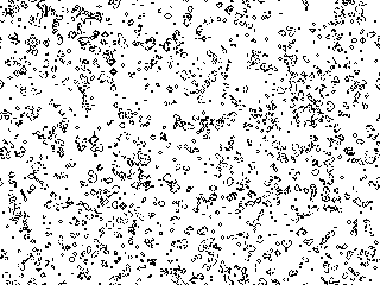

[![MIT License][license-shield]][license-url]
[![LinkedIn][linkedin-shield]][linkedin-url]
![GitHub go.mod Go version][goversion-url]
![Go Report Card][goreport-url]
<!-- PROJECT LOGO -->
 

  <h3 align="center">Game of Life</h3>

  

  Implementation of John Conway's Game of Life written in Go using the Ebiten graphics library.
     
    
  

<!-- LICENSE -->
## License

Distributed under the MIT License. See `LICENSE` for more information.

<!-- ACKNOWLEDGEMENTS -->
## Acknowledgements

* [John Horton Conway](https://en.wikipedia.org/wiki/John_Horton_Conway)

<!-- MARKDOWN LINKS & IMAGES -->
<!-- https://www.markdownguide.org/basic-syntax/#reference-style-links -->
[license-shield]: https://img.shields.io/github/license/michaelmcallister/conway.svg?style=flat-square
[license-url]: https://github.com/michaelmcallister/blob/master/LICENSE.txt
[linkedin-shield]: https://img.shields.io/badge/-LinkedIn-black.svg?style=flat-square&logo=linkedin&colorB=555
[linkedin-url]: https://linkedin.com/in/mpmcallister
[goversion-url]: https://img.shields.io/github/go-mod/go-version/michaelmcallister/conway
[goreport-url]: https://goreportcard.com/badge/michaelmcallister/conway